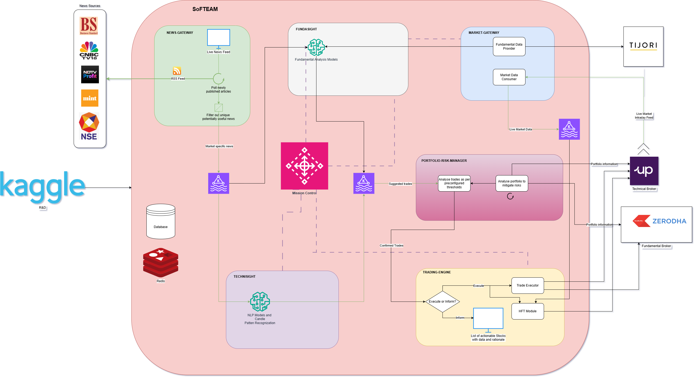

# SoFTEAM Overview


SoFTEAM stands for SOham's Fundamental and technical Trading Engine and Analyser for Markets. It is a project to analyse current and historic data from the Indian stock exchange, and to provide recommendations and execute trades based on fundamanetal and technical analysis, with possibility to prepare and train models to predict stock trend. 

# Architecture



# Features

## TA analysis

- Automatically persist historic data in CSV format, available for personal use out of the service too.
- Provides TA data for following :
    - Close
    - Close EMA
    - Volume
    - Volume EMA
    - % deviation b/n actual volume and average
    - MACD
    - MACD Signal
    - RSI
    - Best fit regression channel data
- Automatically analyse TA data and provide a comprehensive view of trend reversals and interesting events in a trade history

## Zerodha Kite Integration 
- Login into you acc using App provided 2FA code
- Execute the following operations
    - View essential data
        - Orders
        - Positions
        - Holdings
        - Margins
    - Order related activity like Place Buy or Sell calls, with GTTs
    - Create modify and delete GTT and OCO Sell calls


# Instructions to run in local

Please ensure docker is installed in your system and added to PATH variable. Execute following command in project root directory

## Mac OS

```bash
chmod 777 Local_Run_Scripts/mac_run.sh && ./Local_Run_Scripts/mac_run.sh --DEBUG false
```
## Windows Powershell

Normal
```ps1
Set-ExecutionPolicy RemoteSigned -Scope Process -Force; ./Local_Run_Scripts/run.ps1 --DEBUG false
```
Debug
```ps1
Set-ExecutionPolicy RemoteSigned -Scope Process -Force; ./Local_Run_Scripts/run.ps1 --DEBUG true
```

Confluence - https://softeam874.atlassian.net/wiki/spaces/SOfTEAM/overview