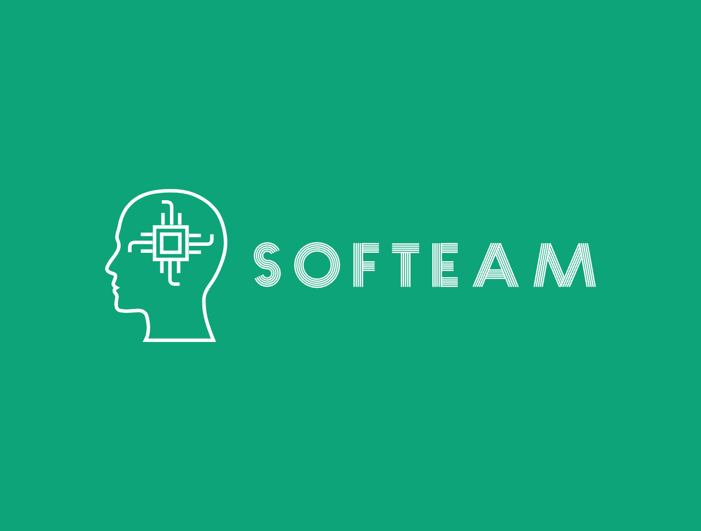
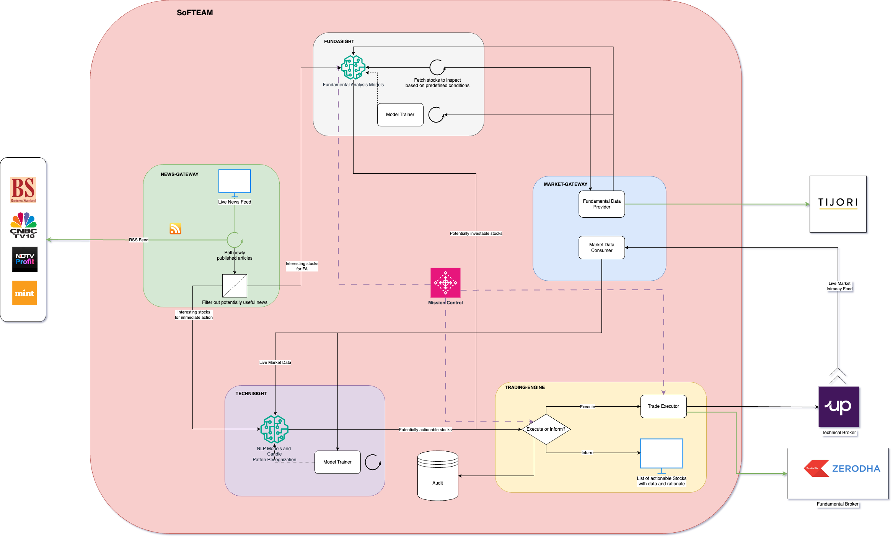

# SoFTEAM Overview



SoFTEAM stands for SOham's Fundamental and technical Trading Engine and Analyser for Markets. It is a project to analyse current and historic data from the Indian stock exchange, and to provide recommendations and execute trades based on fundamanetal and technical analysis, with possibility to prepare and train models to predict stock trend. 

# Architecture



# Current  Functionalities

Currently this project can run only in local systems. Following tables highlight the available endpoints, their details and examples.

Base URL for the service :-

```
http://localhost:8080/
```
Endpoint details are as follows

## System

| Endpoint  | Request Type | Parameters | Description | Example |
| :---: | :---: | :--- |:----   |   :----:|
| /health | GET | N/A  | Tells if the service is running and healthy      |  http://localhost:8080/health  |

## Config endpoints

| Endpoint  | Request Type | Parameters | Description | Example |
| :---: | :---: | :--- |:----   |   :----:|
| /config/taConfigParams | GET, POST | JSON fetched from the GET request with updated values as payload  | Fetch and update the config values that will be used to calculate TA data  |  http://localhost:8080/config/taConfigParams  |
| /config/rssConfigParams | GET, POST | JSON fetched from the GET request with updated values as payload | Update the config values that will be used to fetch RSS feed data  |  http://localhost:8080/config/rssConfigParams  |

## TA Analysis endpoints

| Endpoint  | Request Type | Parameters | Description | Example |
| :---: | :---: | :--- |:----   |   :----:|
| /analysis/getStockData?start_date=yyyy-mm-dd&end_date=yyyy-mm-dd&symbol=xxx | GET | start_date, end_date, symbol  | Fetch Historic OHLCV data for a stock from NSE, based on start and end date and stock code       |  http://localhost:8080/analysis/getStockData?start_date=2023-06-02&end_date=2024-01-01&symbol=ITC  |
| /analysis/getStockTaData?start_date=yyyy-mm-dd&end_date=yyyy-mm-dd&symbol=xxx | GET | start_date, end_date, symbol  | Fetch calculated TA data for a stock from NSE, based on start and end date and stock code       |  http://localhost:8080/analysis/getStocTaData?start_date=2023-06-02&end_date=2024-01-01&symbol=ITC  |
| /analysis/generateTaResult?symbolList=s1,s2 | GET | A comma seperated list of Stocks for analysis sent as query parameter | View the ta results for the stocks, along with interesting datapoints highlighted  |  http://localhost:8080/analysis/generateTaResult?symbolList=ITC,HCLTECH  |

## Kite endpoints

| Endpoint  | Request Type | Parameters | Description | Example |
| :---: | :---: | :--- |:----   |   :----:|
| /kite/login?totp=otp | GET | 2FA OTP generated by the Kite app | Authenticates the service with your Kite trading account. If otp is not provided, it is expected an auth activity was already performed before. Please ensure your Kite UserName and Password are present in the Dockerfile |  http://localhost:8080/kite/login?totp=123456  |
| /kite/fetch-data?method=m | GET | any value among holdings, positions, orders, margins, triggers | A test URL which fetches different values from your demat acc |  http://localhost:8080/kite/fetch-data?method=holdings  |

## News feed endpoints

| Endpoint  | Request Type | Parameters | Description | Example |
| :---: | :---: | :--- |:----   |   :----:|
| /news/live-news-feed | GET |   | Opens a browser page to display live feed of incoming news as published by different websites |  http://localhost:8080/news/live-news-feed  |

# Features

## TA analysis

- Automatically persist historic data in CSV format, available for personal use out of the service too.
- Provides TA data for following :
    - Close
    - Close EMA
    - Volume
    - Volume EMA
    - % deviation b/n actual volume and average
    - MACD
    - MACD Signal
    - RSI
    - Best fit regression channel data
- Automatically analyse TA data and provide a comprehensive view of trend reversals and interesting events in a trade history

## Zerodha Kite Integration 
- Login into you acc using App provided 2FA code
- Execute the following operations
    - View essential data
        - Orders
        - Positions
        - Holdings
        - Margins
    - Order related activity like Place Buy or Sell calls, with GTTs
    - Create modify and delete GTT and OCO Sell calls


# Instructions to run in local

Please ensure docker is installed in your system and added to PATH variable. Execute following command in project root directory

## Mac OS

Normal
```bash
chmod 777 Local_Run_Scripts/mac_run.sh && ./Local_Run_Scripts/mac_run.sh --DEBUG=false
```
Debug
```bash
chmod 777 Local_Run_Scripts/mac_run.sh && ./Local_Run_Scripts/mac_run.sh --DEBUG=true
```
## Windows Powershell

Normal
```ps1
Set-ExecutionPolicy RemoteSigned -Scope Process -Force; ./Local_Run_Scripts/run.ps1 --DEBUG false
```
Debug
```ps1
Set-ExecutionPolicy RemoteSigned -Scope Process -Force; ./Local_Run_Scripts/run.ps1 --DEBUG true
```